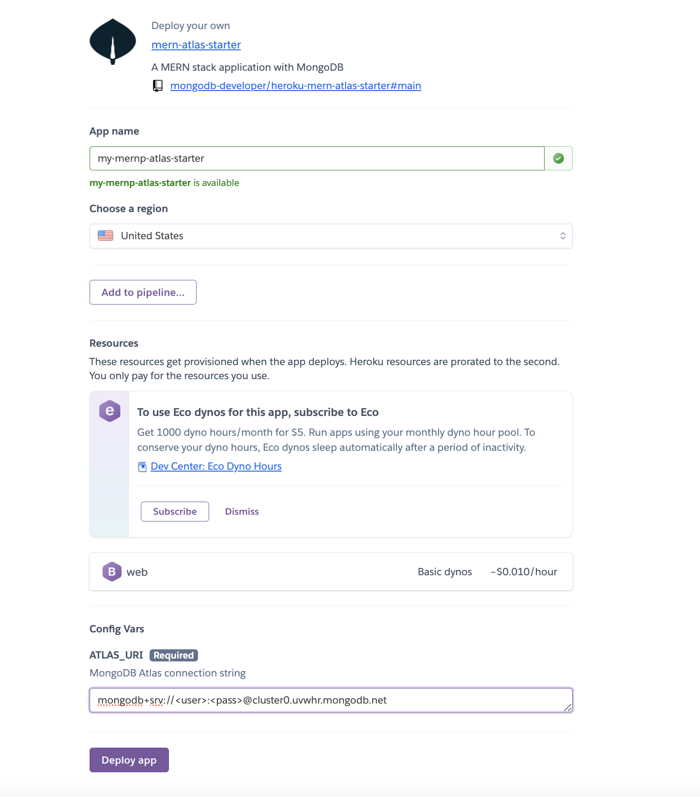

# Heroku MERN Atlas starter app

Using Mern Stack code for the [Mern Tutorial](https://www.mongodb.com/languages/mern-stack-tutorial)

[](https://heroku.com/deploy?template=https://github.com/mongodb-developer/heroku-mern-atlas-starter)

[](https://github.com/mongodb-developer/mern-stack-example/actions/workflows/main.yaml)

## The app.json file

The `app.json` file is building a small mern application on [Heroku.com](https://heroku.com) 

```json
{
    "name": "mern-atlas-starter",
    "description": "A MERN stack application with MongoDB",
    "logo": "https://webimages.mongodb.com/_com_assets/cms/kusbhnrd813qmv46m-MongoDBLeaf1.png",
    "repository": "https://github.com/mongodb-developer/heroku-mern-atlas-starter",
    "keywords": ["node", "express", "react", "mongodb", "heroku", "atlas"],
    "env": {
      "ATLAS_URI": {
        "description": "MongoDB Atlas connection string",
        "required": true
      }
    },
    "buildpacks": [
      {
        "url": "heroku/nodejs"
      }
    ]
  }
```

Additionally, there is a small `package.json` to orchestrate the client and server deploy:
```json
{
    "name": "heroku-mern-atlas-starter",
    "scripts": {
      "postinstall": "cd mern/client && npm install && npm run build && mv dist ../server/public",
      "start": "cd mern/server && npm install && npm start"
    }
  }
```

The button on the top can be used to deploy this repo into the Heroku.

Input your Atlas Cluster to integrate the service with [MongoDB Atlas](https://www.mongodb.com/docs/atlas/getting-started/).


## The project

Local version of the code can be found here:
- https://github.com/mongodb-developer/mern-stack-example


## Disclaimer

Use at your own risk; not a supported MongoDB product
